list-comprehension-demos
========================

This repository contains some demos made possible by the addition of list comprehension to OpenSCAD.
In particular it contains a user-space sweep() module which can be used to sweep a 2D shape along a 3D path.

This is a fork of another repository and is aimed at a new version of sweep.scad. A demo of the new version is also included. 

To use these demos, first install the scad-utils library (https://github.com/openscad/scad-utils) in OpenSCAD's library path.

## [SweepDemo.scad](SweepDemo.scad)

It is a parametric demo that explores the functionality of the OpenSCAD Customizer version 2016.08.18, a snapshot version. Download also the SweepDemo.json and put it in the same directory and the Customizer will preload the cases illustrated below. Certainly it may be tried with other versions by editing the parameter values. 

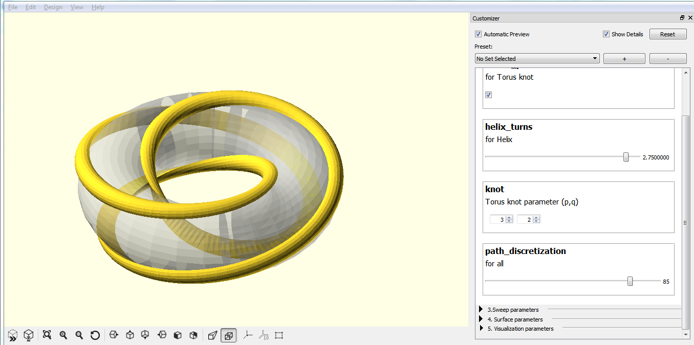

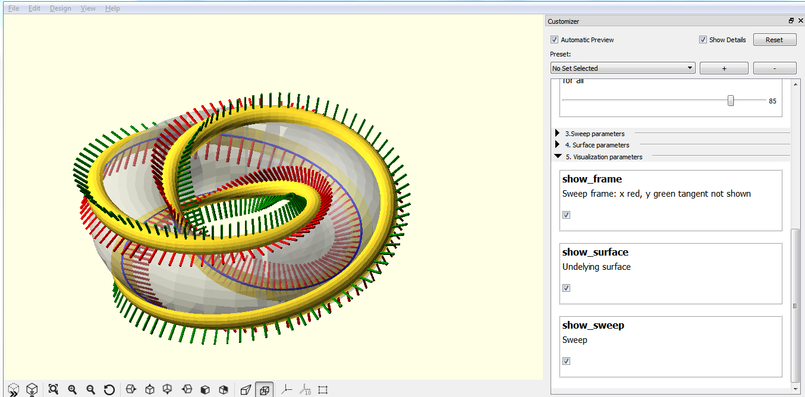

## [extrusion.scad](extrusion.scad)

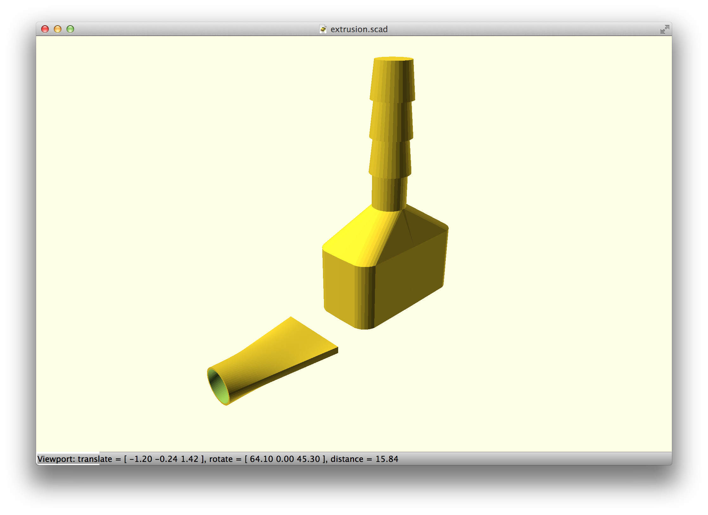

## [forma-candle-holder.scad](forma-candle-holder.scad)

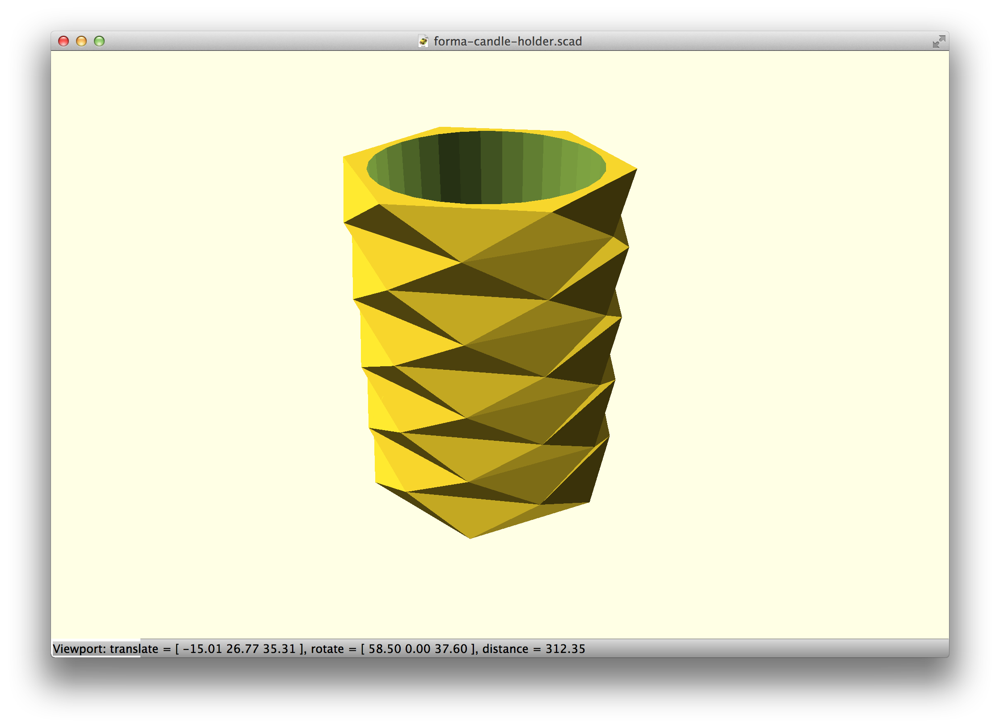

## [superformula.scad](superformula.scad)

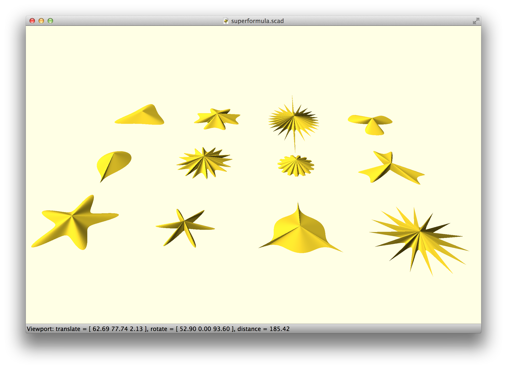

## [sweep-drop.scad](sweep-drop.scad)

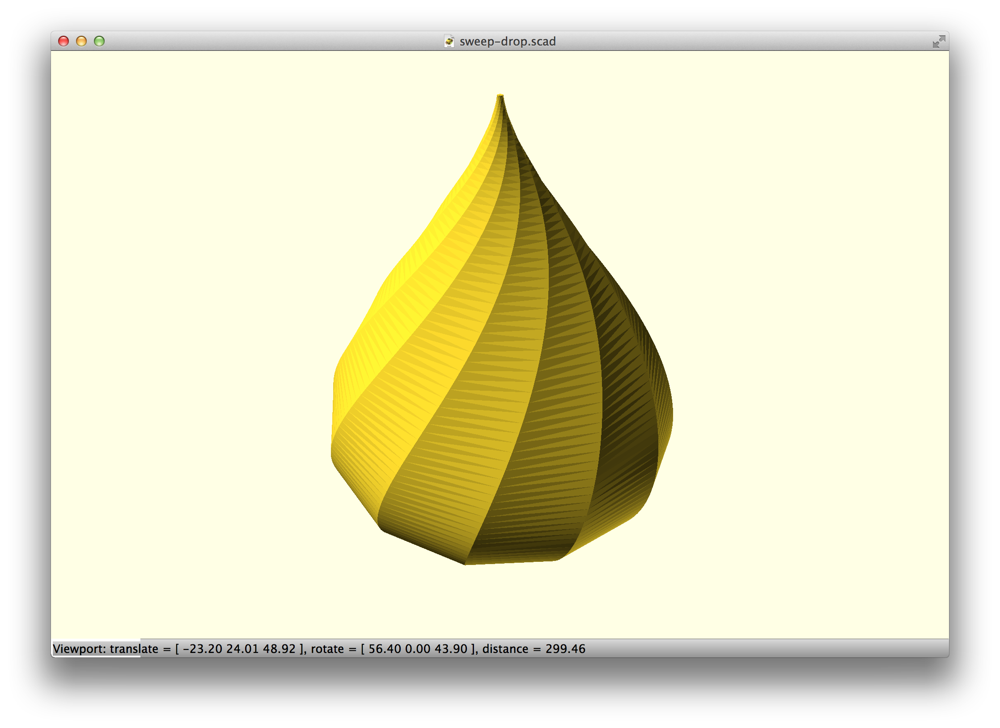

## [sweep-path.scad](sweep-path.scad)

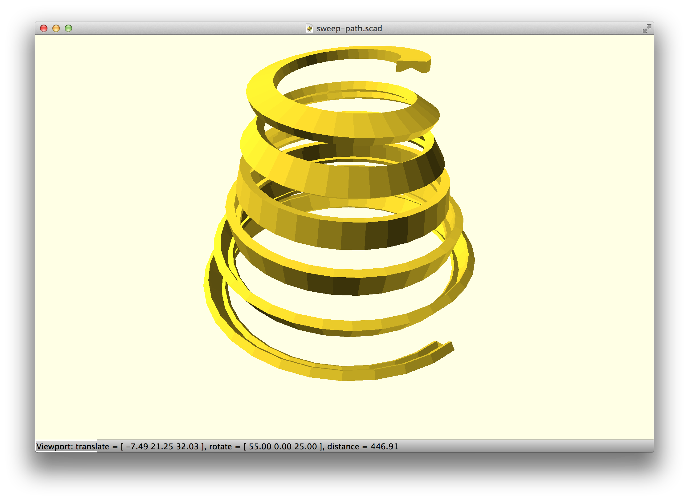

## [sweep-test.scad](sweep-test.scad)

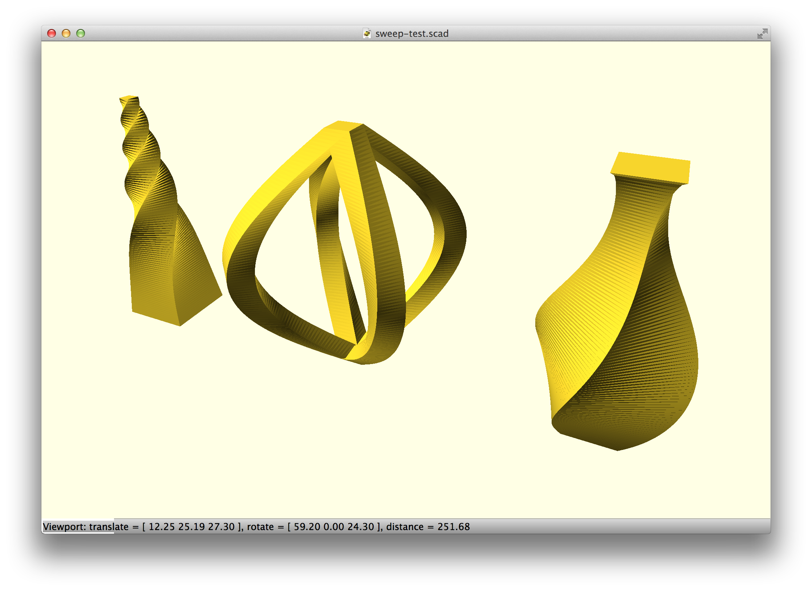

## [toothed-belt.scad](toothed-belt.scad)

## [trefoil-knot-sweep.scad](trefoil-knot-sweep.scad)

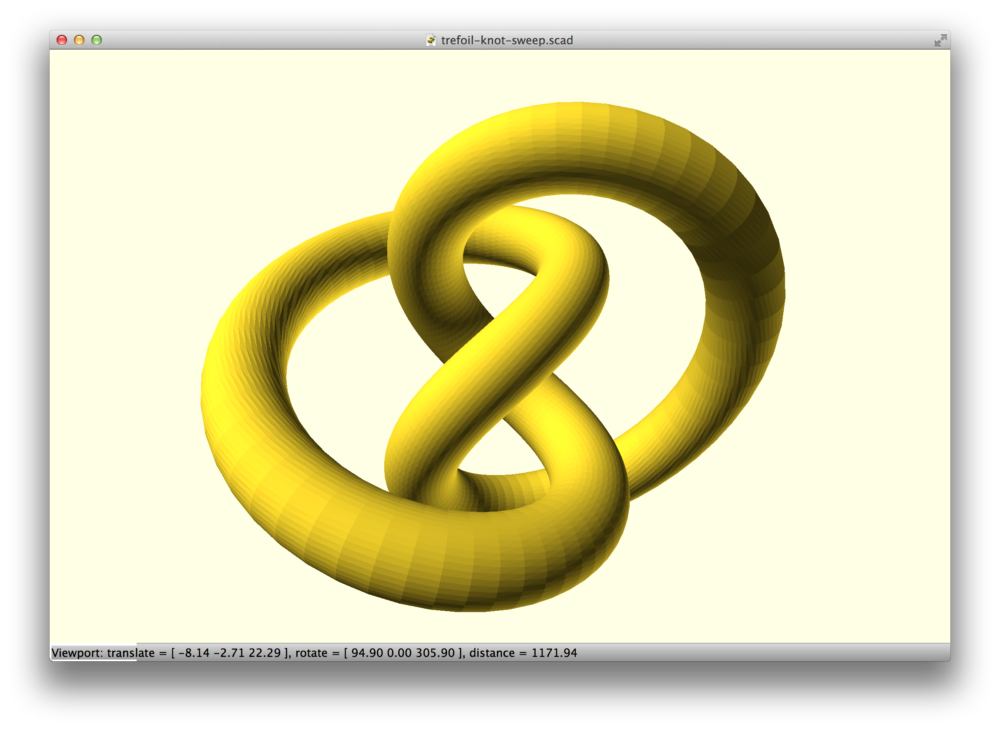

## [wave-cylinder.scad](wave-cylinder.scad)

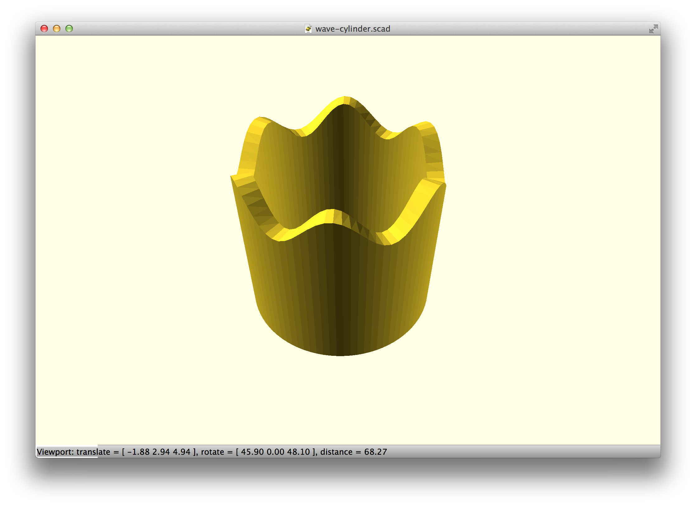

## [3d-function.scad](3d-function.scad)

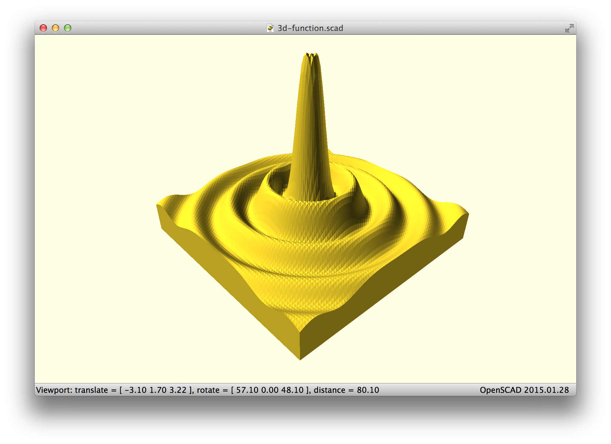

## [spiral-2d.scad](spiral-2d.scad)

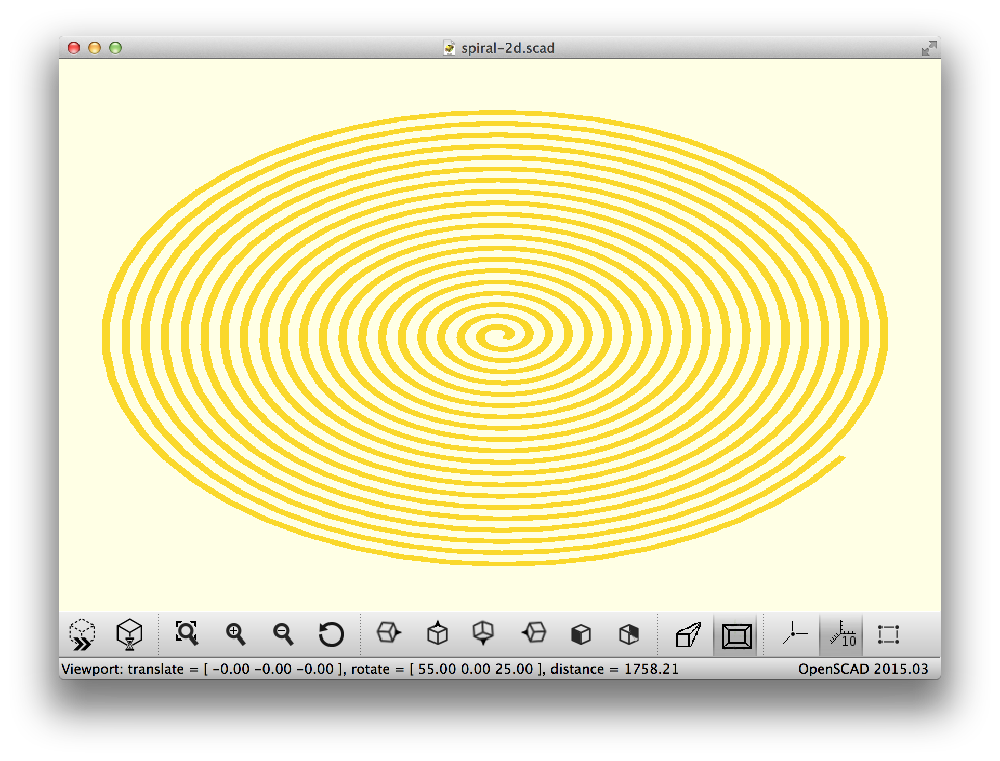
